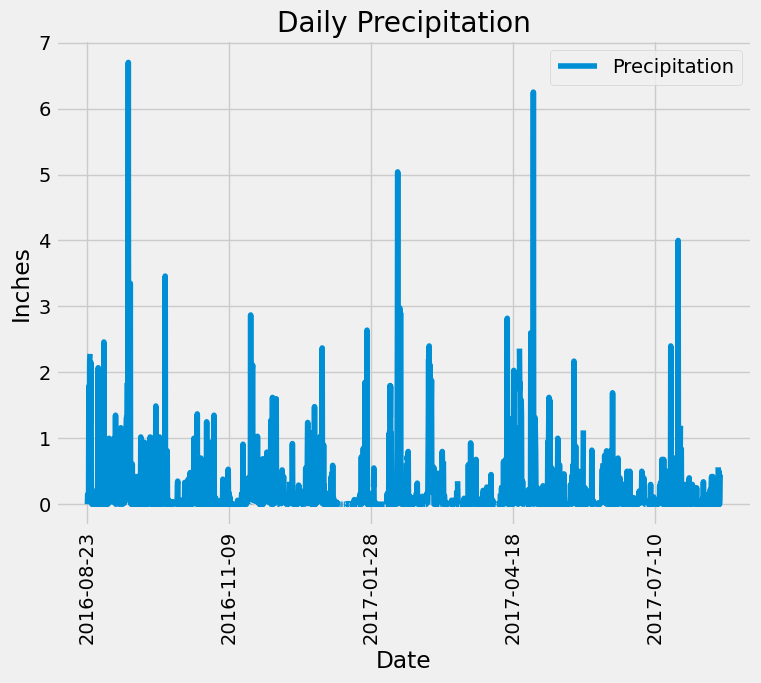
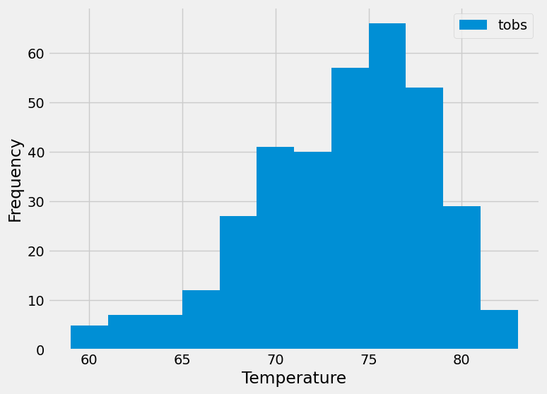

# Bryan Johnson's GWU Module 10 SQLAlchemy Assignment READ ME File

## The files for this assignment can be found at the following repo:
https://github.com/bryanpijohnson/sqlalchemy-challenge

## Within the repo link, you will find the following folders and files to be reviewed and graded:

- **README.md** - that is this file. :)
- **SurfsUp** - this is the folder where the following files/folders live
    - **Resources** - this folder holds the sqlite and CSV files to create the database in Python
    - **app.py** - this is the Python file where the Climate App can be found
    - **climate_starter.ipynb** - this is the Jupyter Notebook file where the initial station and measurement analysis is done

## Climate Analysis

After importing the correct libraries, building the engine to the database, and reflecting/creating the classes for the tables, I was able to find the *most_recent_date* in the measurement data, then used the datetime module to find the date one year prior.

I then used both of those dates to filter the measurement data and turn that into a DataFrame. Plotting it gave the plot shown below:

